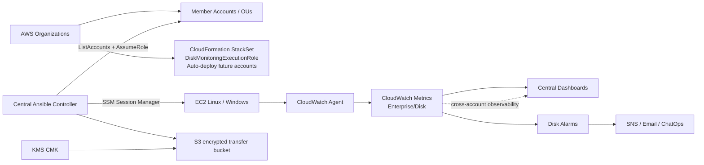

# Scalable Disk Monitoring Solution for AWS

**Lucidity Solutions Architect Case Study**

## Executive summary

This design uses **Ansible for fleet discovery, enrollment and configuration** and **AWS Systems Manager + CloudWatch Agent for continuous disk telemetry**. The solution is designed for an AWS Organization with many accounts, Regions, Linux and Windows EC2 instances.

The key design choice is to avoid making Ansible a permanent polling engine. Ansible is excellent for desired-state configuration, but a continuous monitoring system should use a purpose-built telemetry service. Therefore:

1. **AWS Organizations + CloudFormation StackSets** automatically place the required IAM role in member accounts, including future accounts.
2. A central **Ansible controller** discovers accounts/EC2 instances and assumes a narrowly scoped `DiskMonitoringExecutionRole` in each account.
3. Ansible connects to EC2 through **AWS Systems Manager Session Manager/SSM**, so no inbound SSH/WinRM ports or host credentials are required.
4. Ansible installs/configures the **CloudWatch Agent** on enrolled Linux and Windows instances.
5. The agent publishes disk utilization every 60 seconds to CloudWatch using a dedicated namespace: `Enterprise/Disk`.
6. **CloudWatch cross-account observability** provides centralized visibility; dashboards and alarms live in a dedicated monitoring account. AWS Organizations can automatically onboard future source accounts.
7. Alarms notify operations through SNS. Optional remediation can later invoke SSM Automation or Lucidity's own auto-scaling workflow.

### Why this fits the brief

- Leverages the company's existing **Ansible** investment.
- Uses AWS-native services only where they materially improve reliability and scale.
- Removes inbound management access to VMs.
- Handles new AWS accounts and large VM fleets without maintaining a static inventory.
- Supports both **Linux and Windows Server**.
- Gives operations a single monitoring view while keeping account boundaries intact.

## Architecture

See `docs/architecture.mmd` for the editable Mermaid diagram and `docs/architecture.png` for the presentation diagram.



## Why this architecture?

Ansible remains the existing enterprise automation standard and is responsible for discovery, enrollment and configuration. AWS Systems Manager removes the need for inbound management access. CloudWatch Agent is used for continuous telemetry because it is purpose-built for metric collection. CloudWatch cross-account observability provides centralized visibility without flattening account security boundaries. CloudFormation StackSets makes account onboarding automatic.


## 1. Ease of access and management

### Account model

Assume the enterprise has an AWS Organization with a management account and OUs such as `Production`, `Staging`, and `Sandbox`.

A dedicated **Monitoring/Tooling account** hosts the Ansible controller and CloudWatch monitoring resources. The management account remains tightly controlled.

### Cross-account access

A CloudFormation StackSet with **service-managed permissions** deploys `DiskMonitoringExecutionRole` into selected OUs. Automatic deployment is enabled, so a new account added to a target OU receives the role without manual work.

The role is intentionally narrow:

- `ec2:DescribeInstances`
- `ec2:DescribeTags`
- `ssm:DescribeInstanceInformation`
- `ssm:StartSession`
- `ssm:TerminateSession`
- `ssm:ResumeSession`
- limited S3 access to the Ansible SSM transfer bucket
- CloudWatch Agent administration permissions needed by the enrollment role

For production, split discovery and execution into separate roles if the security team requires stronger separation of duties.

### VM access

**Do not use SSH/WinRM as the default management path.** EC2 instances run SSM Agent and have an instance profile containing `AmazonSSMManagedInstanceCore`.

Ansible uses the `amazon.aws.aws_ssm` connection plugin. The connection is established through Systems Manager, and the controller uses a temporary STS session obtained by assuming the target-account role.

Required network pattern:

- EC2 -> AWS Systems Manager endpoints over HTTPS/443.
- EC2 -> S3 over HTTPS/443 for Ansible SSM file transfer.
- Prefer VPC interface endpoints for `ssm`, `ssmmessages`, and `ec2messages` where supported, plus an S3 gateway endpoint, to keep management traffic private.
- No inbound 22/5985/5986 requirement.

## 2. VM discovery and enrollment

The custom Ansible dynamic inventory script:

`ansible/inventory/aws_org_inventory.py`

performs:

1. `organizations:ListAccounts` from the monitoring/controller account.
2. For every active member account, `sts:AssumeRole` into `DiskMonitoringExecutionRole`.
3. Enumerates configured Regions.
4. Calls `ec2:DescribeInstances` and selects running EC2 instances.
5. Publishes host variables required by `amazon.aws.aws_ssm`:
   - instance ID
   - account ID
   - Region
   - temporary STS credentials
   - S3 transfer bucket
6. Ansible groups instances by OS/account/Region.

The inventory is generated at runtime, so there is **no static list of VM IP addresses** to maintain.

### Enrollment marker

The playbook uses the tag `DiskMonitoring=enabled` as an explicit opt-in. In an enterprise rollout, the tag can be applied automatically to all production instances through provisioning pipelines, AWS Organizations tag policies, or a separate enrollment playbook.

## 3. Data collection

### Continuous collection

Ansible installs the CloudWatch Agent and writes an OS-specific configuration:

- Linux: `disk_used_percent` for all mounted filesystems.
- Windows: Windows `LogicalDisk` `% Free Space`, published as `disk_free_percent`; alerting uses metric math `100 - disk_free_percent` for used percentage.

The metric namespace is:

`Enterprise/Disk`

For Linux the primary metric is `disk_used_percent`. For Windows the primary metric is `disk_free_percent`; CloudWatch metric math converts it to used percentage for alarms/dashboards.

Useful dimensions include:

- `InstanceId`
- `InstanceType`
- `AccountId`
- `Region`
- `Path`/disk instance (Linux) or `LogicalDisk` instance (Windows)

Collection interval: **60 seconds**.

### Why not run `df` every minute from Ansible?

Ansible is configuration/orchestration software, not a time-series monitoring engine. Running a large Ansible fleet job every minute would create controller load, connection churn, and unnecessary API calls. Ansible should establish the desired state; CloudWatch Agent should continuously emit telemetry.

For the case study, `ansible/playbooks/collect_disk_once.yml` is included as a minimal one-shot validation path. It proves that Ansible can collect disk data through SSM even before CloudWatch Agent is deployed.

## 4. Aggregation and presentation

Use a dedicated CloudWatch **monitoring account**.

Enable CloudWatch cross-account observability for the selected OUs/Organization and share the `Enterprise/Disk` namespace. CloudWatch supports centralized viewing of source-account metrics and dashboards. For multi-Region environments, use a cross-account/cross-Region dashboard; if the enterprise requires physical centralization of custom metrics, CloudWatch Metrics Centralization can be added later.

Dashboard examples:

- Fleet-wide disk utilization by account.
- Top 20 filesystems by utilization.
- Instances above 80%, 90%, and 95%.
- Trend over the last 24 hours / 7 days.
- Unhealthy/unmanaged SSM instances.

## 5. Alerting strategy

Recommended thresholds:

| Level | Condition | Action |
|---|---|---|
| Warning | >= 80% used for 10 minutes | SNS notification / ticket |
| Critical | >= 90% used for 10 minutes | Page on-call |
| Emergency | >= 95% used for 5 minutes | Page + automated remediation candidate |

Do not alert on a single sample. Use `EvaluationPeriods` and `DatapointsToAlarm` to avoid transient spikes.

A second set of alarms should detect **missing telemetry** / stale agents, because "no metric" must not be interpreted as "disk healthy".

## 6. Security controls

- **No long-lived AWS keys** on the Ansible controller.
- Controller obtains temporary credentials through its own IAM role and STS AssumeRole.
- Target-account role has least-privilege permissions.
- EC2 uses `AmazonSSMManagedInstanceCore` rather than SSH keys.
- S3 transfer bucket is private, encrypted with KMS, versioned, and has public access blocked.
- CloudTrail records STS, IAM, SSM and CloudFormation activity.
- Use AWS Config/SCPs to prevent unmanaged production instances where appropriate.
- Secrets are not stored in Git.
- Ansible vault is only needed for non-AWS secrets; AWS authentication uses IAM roles.

## 7. Scalability

### New account

AWS Organizations + StackSets automatically deploy the target role to a new account in a monitored OU. The inventory discovers it on the next run. No inventory file edit is required.

### New VM

A newly launched EC2 instance with SSM Agent + the required instance profile and `DiskMonitoring=enabled` is discovered automatically. The scheduled enrollment playbook installs/configures the agent.

### New Region

Add the Region to `AWS_REGIONS` or make Region discovery automatic in a future version. The inventory logic is already account/Region aware.

### Large fleet

Use Ansible forks/concurrency carefully, for example:

- controller worker pool
- `serial`/`throttle` for sensitive changes
- inventory caching
- scheduled enrollment every 5–15 minutes rather than continuous polling
- CloudWatch Agent for the high-frequency data path

CloudFormation StackSets can also control deployment concurrency and failure tolerance across accounts.

## 8. Failure handling

| Failure | Detection | Response |
|---|---|---|
| SSM unavailable | Inventory/SSM check fails | Mark host unmanaged; alert separately |
| CloudWatch Agent stopped | Missing metric alarm | Restart agent via SSM Automation/Ansible |
| Disk > 80% | CloudWatch alarm | Ticket / notification |
| Disk > 90% | Critical alarm | Page on-call |
| Ansible controller unavailable | Scheduled-job monitoring | Run controller redundantly / CI runner |
| Account added to OU | StackSet auto deployment | Role appears automatically |
| VM added | Dynamic inventory | Next enrollment run configures it |

## 9. Repository contents

```text
.
├── README.md
├── requirements.txt
├── docs/
│   ├── architecture.mmd
│   ├── architecture.png
│   └── design.md
├── bootstrap/
│   └── cloudformation/
│       └── disk-monitoring-role.yaml
├── ansible/
│   ├── ansible.cfg
│   ├── inventory/
│   │   └── aws_org_inventory.py
│   ├── playbooks/
│   │   ├── collect_disk_once.yml
│   │   └── enroll_cloudwatch_agent.yml
│   └── roles/
│       └── disk_monitor/
│           ├── defaults/main.yml
│           ├── tasks/main.yml
│           └── templates/
│               ├── cloudwatch-linux.json.j2
│               └── cloudwatch-windows.json.j2
├── scripts/
│   └── create_dashboard.py
└── tests/
    └── README.md
```

## 10. Demo / minimal working flow

### Prerequisites

```bash
python3 -m venv .venv
source .venv/bin/activate
pip install -r requirements.txt
ansible-galaxy collection install -r requirements.yml
```

Install the AWS Session Manager plugin on the controller.

Set environment variables:

```bash
export AWS_REGION=us-east-1
export AWS_S3_BUCKET=YOUR_PRIVATE_ANSIBLE_TRANSFER_BUCKET
export AWS_REGIONS=us-east-1,us-west-2
export AWS_ROLE_NAME=DiskMonitoringExecutionRole
```

Check inventory:

```bash
ansible-inventory -i ansible/inventory/aws_org_inventory.py --graph
```

One-shot collection:

```bash
ansible-playbook -i ansible/inventory/aws_org_inventory.py \
  ansible/playbooks/collect_disk_once.yml
```

Enroll CloudWatch Agent:

```bash
ansible-playbook -i ansible/inventory/aws_org_inventory.py \
  ansible/playbooks/enroll_cloudwatch_agent.yml
```

## 11. Production evolution

This case-study implementation intentionally keeps the core architecture simple. In production I would add:

- CI/CD validation of Ansible roles.
- Ansible Rulebook/Event-Driven Ansible for remediation triggers.
- CloudWatch Synthetics/health checks for the monitoring pipeline.
- AWS Config rules for SSM-managed-instance compliance.
- Centralized ticketing integration.
- Capacity forecasting based on disk growth rate, not only a static percentage threshold.
- Optional integration with Lucidity for automatic EBS expansion once a critical threshold is reached.

## References

- AWS Systems Manager Run Command / Session Manager
- AWS CloudWatch Agent
- AWS CloudWatch cross-account observability
- AWS Organizations
- CloudFormation StackSets
- Ansible `amazon.aws.aws_ec2` and `amazon.aws.aws_ssm`
